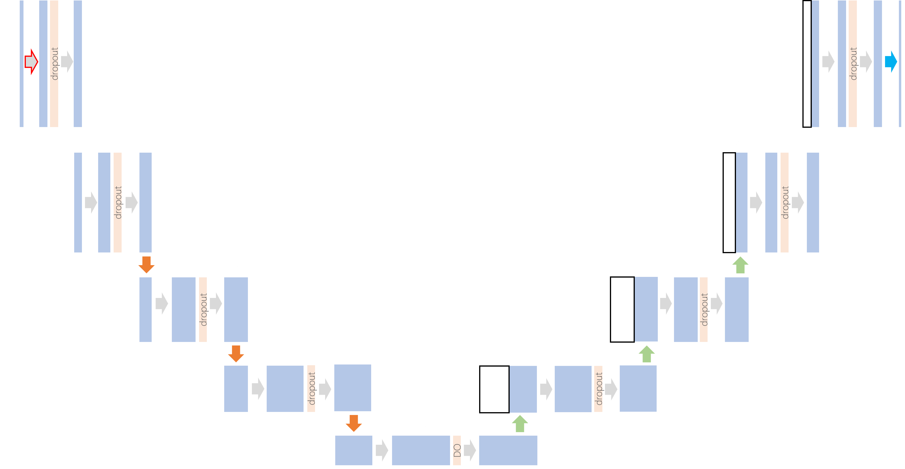
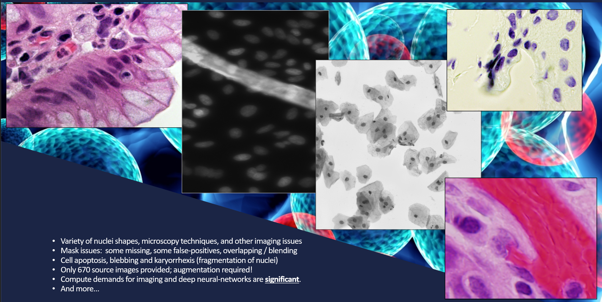
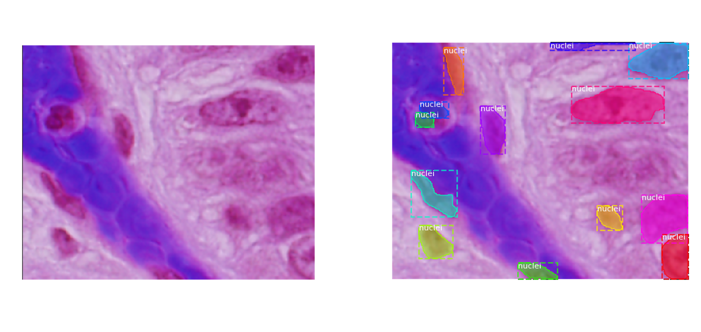

# Cell Nucleus Segmentation Using U-Net Architecture

A deep learning approach to instance segmentation of cell nuclei in microscopy images, developed for the 2018 Data Science Bowl competition.

## Abstract

Automated detection and segmentation of cell nuclei in microscopy images is fundamental to biological research and clinical diagnostics. This project implements a U-Net convolutional neural network architecture (Ronneberger et al., 2015) for semantic segmentation of nuclei across diverse imaging conditions. The model achieves robust performance on a heterogeneous dataset comprising multiple microscopy modalities, staining techniques, and magnification levels. We detail the complete machine learning pipeline including data preprocessing, augmentation strategies, model architecture, and evaluation using Intersection over Union (IoU) metrics at multiple thresholds.


*Figure 1: U-Net encoder-decoder architecture with skip connections*

## Introduction

### Problem Context

The 2018 Data Science Bowl challenged participants to segment individual cell nuclei from microscopy images. Accurate nucleus detection enables researchers to quantify cellular responses to drug treatments, study developmental biology, and advance diagnostic pathology. The challenge presents several technical difficulties:

- **Heterogeneous imaging conditions**: Images span multiple microscopy techniques (brightfield, fluorescence, histopathology) with varying resolutions from 256×256 to 1040×1388 pixels
- **Dense nuclei clustering**: Many images contain 50-100+ tightly packed nuclei requiring precise boundary delineation
- **Annotation quality variance**: Ground truth masks exhibit inconsistencies including internal holes, split annotations, and missing labels

### Why U-Net?

U-Net (Ronneberger, Fischer & Brox, 2015) was originally developed for biomedical image segmentation and remains highly effective for this domain. Key architectural advantages include:

1. **Skip connections** preserve spatial information lost during encoding, enabling precise localization
2. **Symmetric encoder-decoder** structure captures both semantic context and fine-grained detail
3. **Efficient training** on limited biomedical datasets through extensive data augmentation
4. **End-to-end learning** eliminates need for hand-crafted feature extraction

The architecture has become foundational in medical imaging, influencing subsequent designs including Attention U-Net, U-Net++, and nnU-Net.

## Data

### Dataset Characteristics

The training corpus comprises 670 microscopy images with corresponding instance segmentation masks, totaling 30,370 annotated nuclei. Test set contains 65 images without ground truth labels.

| Resolution | Sample Count | Avg. Nuclei/Image |
|------------|--------------|-------------------|
| 256×256    | 210          | 28                |
| 256×320    | 85           | 42                |
| 360×360    | 45           | 67                |
| 512×640    | 120          | 85                |
| 1024×1024  | 95           | 103               |
| Other      | 115          | 56                |

### Data Quality Analysis

Exploratory analysis revealed systematic annotation issues requiring consideration during preprocessing:

- **Masks with internal holes** (443 instances): Foreground regions containing background pixels, likely from annotation tool artifacts
- **Split masks** (20 instances): Single nuclei annotated as multiple disconnected components
- **Linear artifacts** (4 instances): Non-nuclear structures incorrectly labeled
- **Sub-pixel nuclei** (<3 pixels): Annotations too small for meaningful segmentation


*Figure 2: Examples of annotation inconsistencies identified through contour analysis*

These findings informed preprocessing decisions and highlight the importance of robust model design when working with imperfect annotations.

## Methods

### Preprocessing Pipeline

All images undergo standardized preprocessing to ensure consistent model input:

1. **Color space conversion**: RGB to grayscale using luminosity method
   ```
   Y = 0.0722·B + 0.7152·G + 0.2126·R
   ```

2. **Spatial normalization**: Images resized to 256×256 pixels. Smaller images are padded; larger images are downsampled with bilinear interpolation.

3. **Mask consolidation**: Individual nucleus masks merged into single binary segmentation map per image.

4. **Intensity normalization**: Pixel values scaled to [0, 1] range via Lambda layer during model inference.

### Data Augmentation

To address limited training data and improve generalization, we apply stochastic augmentation using Keras `ImageDataGenerator`:

| Transformation | Range | Rationale |
|----------------|-------|-----------|
| Rotation | 0-90° | Nuclei have no preferred orientation |
| Horizontal flip | 50% | Microscopy images lack directional bias |
| Vertical flip | 50% | Microscopy images lack directional bias |
| Width/height shift | ±20% | Robustness to nuclei position |
| Zoom | ±20% | Scale invariance across magnifications |

Augmentation expands the effective training set from 670 to approximately 6,400 samples. Identical transformations are applied to image-mask pairs using synchronized random seeds to maintain spatial correspondence.

### Model Architecture

The implemented U-Net follows the canonical encoder-decoder structure with symmetric contracting and expansive paths.

#### Encoder (Contracting Path)

Each encoder block consists of:
- Two 3×3 convolutions with ELU activation and He normal initialization
- Dropout regularization (increasing with depth: 0.1 → 0.3)
- 2×2 max pooling for spatial downsampling

| Stage | Output Resolution | Filters | Parameters |
|-------|-------------------|---------|------------|
| E1    | 256×256           | 16      | 2,480      |
| E2    | 128×128           | 32      | 13,888     |
| E3    | 64×64             | 64      | 55,424     |
| E4    | 32×32             | 128     | 221,440    |
| E5    | 16×16             | 256     | 885,248    |

#### Decoder (Expansive Path)

Each decoder block consists of:
- 2×2 transposed convolution for upsampling
- Concatenation with corresponding encoder feature maps (skip connection)
- Two 3×3 convolutions with ELU activation

Skip connections concatenate encoder feature maps with decoder outputs at matching resolutions, enabling the network to recover fine spatial details lost during downsampling.

#### Output Layer

A 1×1 convolution with sigmoid activation produces per-pixel probabilities for nucleus presence.

**Total trainable parameters**: 1,940,817

```python
# Bottleneck example
c5 = Conv2D(256, (3,3), activation='elu', padding='same')(p4)
c5 = Dropout(0.3)(c5)
c5 = Conv2D(256, (3,3), activation='elu', padding='same')(c5)

# Decoder block with skip connection
u6 = Conv2DTranspose(128, (2,2), strides=(2,2), padding='same')(c5)
u6 = concatenate([u6, c4])  # Skip connection from encoder
```

### Training Configuration

#### Loss Function

Binary cross-entropy serves as the primary optimization objective:

```
L = -1/N Σ [y·log(ŷ) + (1-y)·log(1-ŷ)]
```

We also implement Dice coefficient loss as an alternative for class-imbalanced segmentation:

```
Dice = (2·|X∩Y| + ε) / (|X| + |Y| + ε)
```

where ε=1 provides numerical stability.

#### Evaluation Metrics

Following competition requirements, we compute mean Intersection over Union (IoU) across thresholds:

```
IoU = TP / (TP + FP + FN)
mAP = mean(IoU_t) for t ∈ {0.5, 0.55, ..., 0.95}
```

This metric rewards precise boundary delineation, as higher thresholds penalize even minor segmentation errors.

#### Training Protocol

| Hyperparameter | Value |
|----------------|-------|
| Optimizer | Adam |
| Batch size | 16 |
| Epochs | 50 (max) |
| Validation split | 20% |
| Early stopping | Patience=10 |

Model checkpointing saves weights only when validation loss improves, preventing overfitting and reducing training time through early termination.

```python
callbacks = [
    EarlyStopping(patience=10, verbose=1),
    ModelCheckpoint('model-dsbowl2018-1.h5', save_best_only=True)
]
```

## Results

### Post-Processing Pipeline

Raw model outputs require post-processing for competition submission:

1. **Thresholding**: Probability maps binarized at t=0.5 (validation) or t=0.9 (test, for higher precision)

2. **Spatial restoration**: Predictions resized to original image dimensions
   - Images smaller than 256×256: Cropped to original size (no interpolation artifacts)
   - Images larger than 256×256: Bilinear upsampling

3. **Instance separation**: Connected component labeling via `skimage.morphology.label` to identify individual nuclei

4. **Run-length encoding**: Binary masks converted to RLE format for Kaggle submission
   ```python
   def rle_encoding(x):
       dots = np.where(x.T.flatten() == 1)[0]
       run_lengths = []
       prev = -2
       for b in dots:
           if (b > prev + 1):
               run_lengths.extend((b + 1, 0))
           run_lengths[-1] += 1
           prev = b
       return run_lengths
   ```

### Prediction Examples


*Figure 3: Sample predictions showing (left) input image, (center) raw probability map, (right) thresholded binary mask*

The model demonstrates robust performance across imaging modalities, though densely clustered nuclei occasionally merge in predictions—a known limitation of semantic segmentation approaches.

## Discussion

### Limitations

1. **Semantic vs. instance segmentation**: The binary segmentation approach cannot distinguish touching nuclei. Post-hoc connected component analysis fails when nuclei overlap, leading to merged predictions. Instance segmentation architectures (Mask R-CNN) or boundary-aware losses may address this limitation.

2. **Resolution normalization**: Resizing large images (1040×1388) to 256×256 discards fine detail, particularly affecting small nuclei detection. Multi-scale inference or patch-based prediction could preserve spatial information.

3. **Annotation noise**: Training on imperfect ground truth (holes, splits) may teach the model incorrect segmentation patterns. Noise-robust loss functions or annotation cleaning pipelines warrant investigation.

### Lessons Learned

- **Data augmentation is critical**: Expanding from 670 to 6,400 samples significantly improved generalization across imaging modalities.

- **Threshold selection matters**: Optimal threshold varies between validation (0.5) and test (0.9) sets, suggesting distribution shift and the value of threshold tuning.

- **EDA prevents silent failures**: Systematic mask analysis revealed annotation issues invisible during casual inspection, informing both preprocessing and result interpretation.

### Future Directions

- Implement attention mechanisms (Attention U-Net) to improve focus on relevant regions
- Explore boundary-aware loss functions for better nucleus separation
- Investigate test-time augmentation for improved prediction stability
- Apply transfer learning from larger biomedical imaging datasets

## Project Structure

```
dsbowl_2018/
├── code/
│   ├── Pre-Process TRAIN Data-restore.ipynb  # Initial data loading
│   ├── Pre-Process TEST Data-restore.ipynb   # Test set preparation
│   ├── Make New Data.ipynb                   # Augmentation pipeline
│   ├── Cell Analysis EDA.ipynb               # Exploratory analysis
│   └── Baseline Model.ipynb                  # U-Net training & inference
├── presentation/                             # Project presentations
└── docs/
    └── images/                               # README figures
```

## Installation

```bash
# Clone repository
git clone https://github.com/cbenge509/dsbowl_2018.git
cd dsbowl_2018

# Install dependencies
pip install numpy pandas matplotlib scikit-image scikit-learn opencv-python
pip install tensorflow==1.x keras tqdm

# Launch Jupyter
jupyter notebook code/
```

## Usage

1. Configure data paths in each notebook (replace `C:/CompetitionData/` with local paths)
2. Execute notebooks in order: Preprocessing → Augmentation → Model Training
3. Trained model saved as `model-dsbowl2018-1.h5`
4. Submission files generated as `submission_*.csv`

## References

Ronneberger, O., Fischer, P., & Brox, T. (2015). U-Net: Convolutional Networks for Biomedical Image Segmentation. In *Medical Image Computing and Computer-Assisted Intervention (MICCAI)*, 234-241. Springer. [arXiv:1505.04597](https://arxiv.org/abs/1505.04597)

He, K., Zhang, X., Ren, S., & Sun, J. (2015). Delving Deep into Rectifiers: Surpassing Human-Level Performance on ImageNet Classification. In *ICCV*. [arXiv:1502.01852](https://arxiv.org/abs/1502.01852)

Data Science Bowl 2018. (2018). Find the nuclei in divergent images to advance medical discovery. Kaggle. https://www.kaggle.com/c/data-science-bowl-2018

## Acknowledgments

- Kaggle and Booz Allen Hamilton for hosting the Data Science Bowl 2018
- The U-Net authors for their foundational architecture
- The scikit-image and Keras communities for excellent documentation

## License

This project is released for educational purposes. See individual dataset terms on Kaggle.
